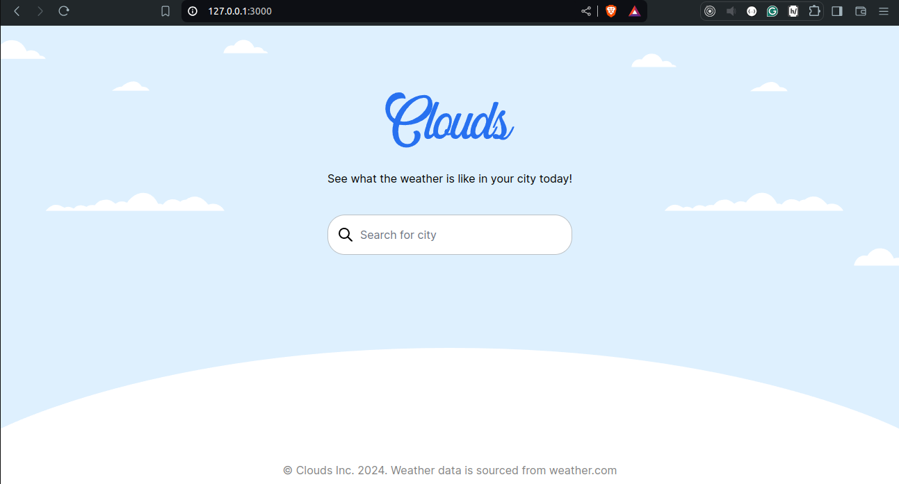
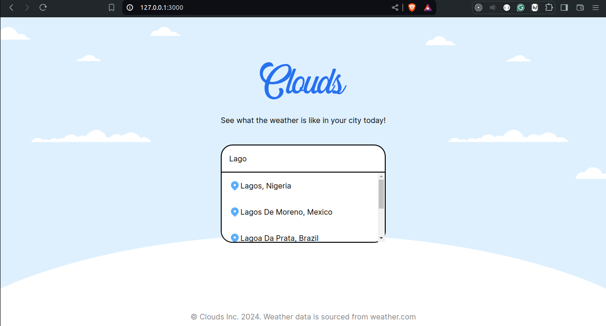
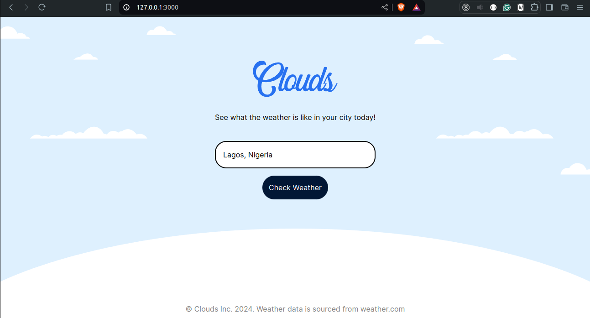
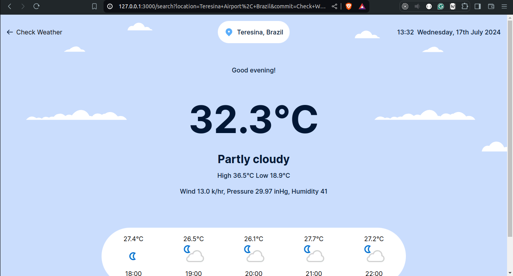
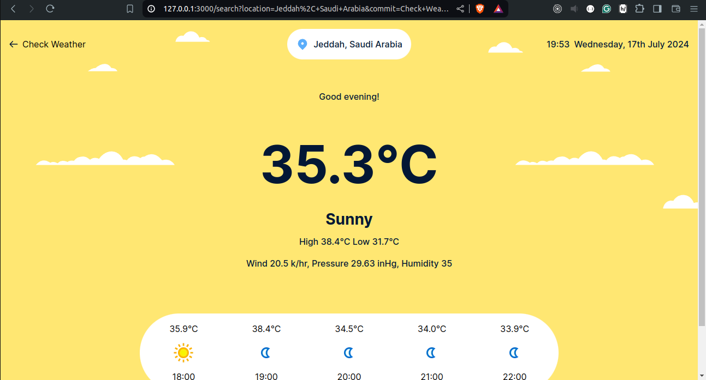

# CLOUDS

This is a weather application built with ruby on rails, tailwindcss and weatherapi.com.
To get started, head straight to weatherapi.com to get an API key.

# Do the following to run this application:

- `cd` into clouds
- run `bundle install`
- run `npm install`
- run `./bin/dev` or `sudo ./bin/dev`

The app should be up and running!

